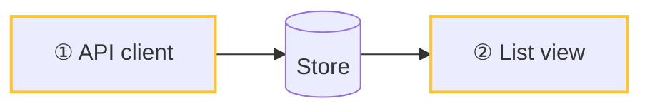

# Digest format

A digest is a **change spec**. It is much smaller than the diff, and a reviewer can match every claim to the code.

**The main rule: every line maps to code.** Each note, bullet, and table row points to the code that it describes, with an anchor. The mapping does not have to be 1:1: an anchor on a parent bullet covers its nested bullets, and an anchor on a `###` heading covers the rows of its table. A line that points to no code is noise or a guess.

**The test for a good digest:** give it and the base commit to a new agent of the same model class. That agent must be able to make a change that behaves the same way. The code does not need to be identical.

## Layout

The tool writes the frontmatter (`diff-digest init`). Do not edit it. You write the body:

````markdown
# <What changed, in one line>

- **Size:** 175 digest lines for 8500 reviewable diff lines in 30 commits.
- **What it does:** Two to four sentences about the behavior, with anchors to the entry points: `path/entry.ts:10-40`
- **New modules:**
  - `pkg/new-module` holds the frame codec: `pkg/new-module/index.ts:1`
- **Changes you can see:**
  - ⚠️ The mode shows MANUAL before the device accepts it: `path/mode.ts:20-31`

**Generated (not reviewed):** `package-lock.json`

## Architecture



1. ① One or two lines: what is different at this node, with an anchor to its main file: `path/client.ts:1-60`
2. ② ...: `path/view.tsx:1-40`

## Changes

- ① `oldThing(a, b)` is now `newThing(a)`. The `b` check moved to the caller: `path/file.ts:10-14`

### Behavior table name `path/file.ts:120-140`

| Case | Before | After |
|---|---|---|

## Tests

| Test | Proves | Why this case |
|---|---|---|
| `test/client.test.ts:12-30` retries twice | The third failure is final | Edge case |

### Test gaps

| Behavior | Missing case | Why it matters |
|---|---|---|
````

## Guidance

`diff-digest lint` checks the rules in the table below. This guidance is what lint cannot check.

- **Summary.** `fmt` writes the **Size** line from the diff; do not count. Write **What it does** (behavior only), **New modules**, and **Changes you can see** (the ⚠️ items), each with anchors. Leave out an item that has nothing in it, except What it does.
- **No intent.** Do not guess why the author made the change. Describe only what the code does.
- **Generated files.** Only list them. Never describe them. `hunks` marks these files as `generated`: lockfiles, snapshots, `__generated__/`, generated protos, and minified or map files. Also `.gitattributes` (`linguist-generated`, `linguist-vendored`) and the `generated` patterns in `~/.diff-digest/config.json`. Binary and LFS files are marked `binary`; list them the same way.
- **Do not mention** import changes, reordered code, or moved code that is otherwise identical.
- **Architecture diagram.** Show modules, components, stores, and data flow. Do not show functions. If the change touches only one module, leave the diagram out. Number the changed nodes in the order of the data flow.
- **Changes.** One bullet for each change. Use this form: *what it was → what it is, and what moved where*, with anchors. Put renames here, not in a separate section. If a bullet is about a numbered node, start it with that node's number, so the reader can go from the diagram to the code.
- **Tables.** Use a table when the behavior depends on a combination of inputs. Use real cases as rows and columns, for example user role × page section. Do not use boolean formulas. Put the values as `before → after` in the cells, or in Before and After columns. Put ⚠️ where a user can see a change or where a change is not safe. Keep unchanged rows when they prove that behavior is equivalent.
- **Anchors.** Write each anchor as a code span: `path:line` or `path:start-end`. Use line numbers in the new file. A unique path suffix is enough. Anchors open in the code pane of the UI.
- **Tests.** For each added or changed test, give the behavior that it proves and why that case was chosen (a regression, an edge case, or an invariant). Put each ⚠️ behavior that has no test in Test gaps.
- **Questions.** Try to answer each question from the code first. Add each question that the code cannot answer as an agent note on the related block (`diff-digest note --ref <ref> "<block text>" "Q: <question>"`). Notes show in the UI and are not published.
- **Size.** Use tables, one-line bullets, and anchors, not paragraphs. For diffs of more than 500 lines, the target is 25% or less of the reviewable diff lines.
